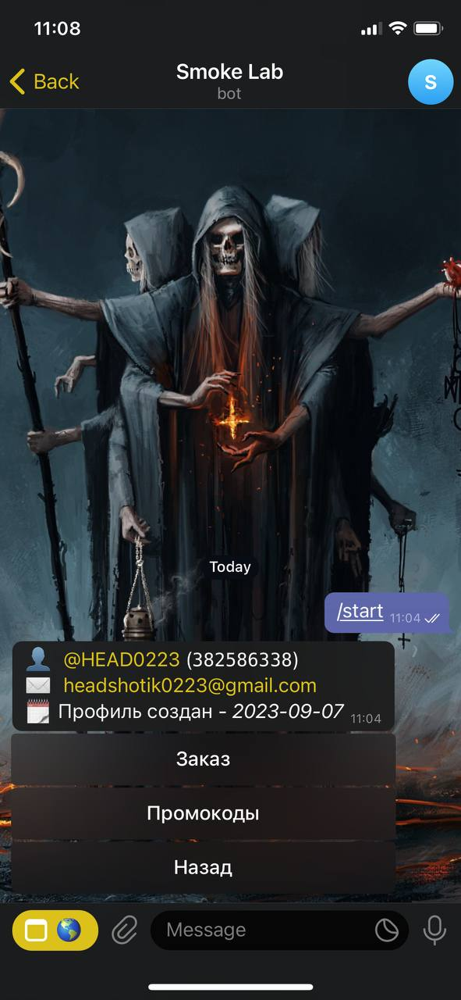

# Smoke Lab (**Bot**)


The Smoke Lab Bot is a comprehensive Telegram bot built to enhance user experience with various features. It includes language change, a user-friendly inline keyboard menu, user profile management, promocode creation, order checking, and status updates. Additionally, an admin panel provides control over stock management, order tracking, promocode administration, user statistics, and administrative privileges.

## Table of Contents

-  [Folder Structure](#folder-structure)
-  [Usage](#usage)
-  [Media](#media)
-  [Contributing](#contributing)
-  [Dependencies](#dependencies)

## Folder Structure

-  **bot:** Folder containing the bot's source code and logic.
-  **run.py:** Python script for running the bot.
-  **requirements.txt:** File specifying the required Python packages and their versions.

## Usage

1. Clone the repository:

```bash
git clone https://github.com/HEAD0223/smoke-lab-bot.git
cd smoke-lab-bot
```

2. Create and activate a virtual environment:

```bash
python3 -m venv venv
source venv/bin/activate
```

3. Install required dependencies:

```bash
pip install --upgrade -r requirements.txt
```

4. Run the bot:

```bash
python run.py
```

## Media

### Mobile

#### User


**Main Page, languages, about us:**


**Profile, promocodes, current order:**



#### Admin Panel


**Stock management, Orders management, finished promocodes:**


**Statistics and user editing, Admin privileges management:**


### PC

#### User


**Main Page, languages, about us:**


**Profile, promocodes, current order:**


#### Admin Panel


**Stock management, Orders management, finished promocodes:**


**Statistics and user editing, Admin privileges management:**


## Contributing

If you would like to contribute to this project, please follow these steps:

1. Fork the repository.
2. Create a new branch for your feature: `git checkout -b feature-name`
3. Commit your changes: `git commit -m 'Add some feature'`
4. Push to the branch: `git push origin feature-name`
5. Submit a pull request.

## Dependencies

-  **aiogram:** Telegram bot library for Python.
-  **aiohttp:** Asynchronous HTTP client/server framework for Python.
-  **aiosignal:** Signal handling library for asyncio.
-  **async-timeout:** Timeout context manager for asyncio.
-  **asyncio:** Asynchronous I/O framework.
-  **attrs:** Python classes without boilerplate.
-  **Babel:** Internationalization framework for Python.
-  **certifi:** Certificates for Python.
-  **charset-normalizer:** Charset normalization library.
-  **dnspython:** DNS toolkit for Python.
-  **frozenlist:** Immutable list data type.
-  **idna:** Internationalized Domain Names in Applications (IDNA) library.
-  **magic-filter:** Asynchronous DNS-based content filtering library.
-  **multidict:** Multidimensional dictionaries for Python.
-  **pandas:** Data manipulation and analysis library.
-  **pymongo:** MongoDB driver for Python.
-  **python-dotenv:** Loads environment variables from a .env file.
-  **pytz:** Time zone library for Python.
-  **yarl:** Yet another URL library for Python.

Make sure to include these dependencies in your virtual environment using `pip install -r requirements.txt`.
